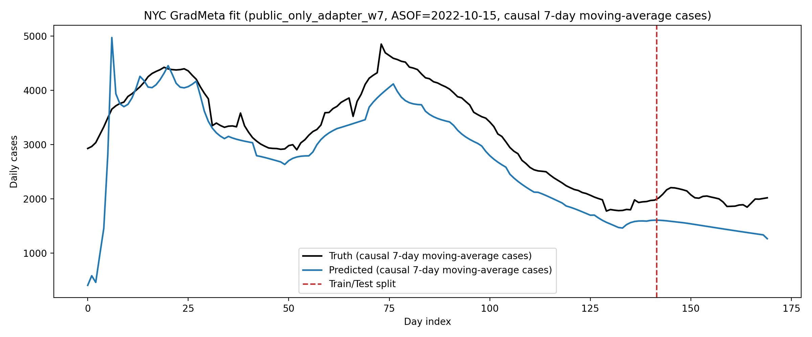
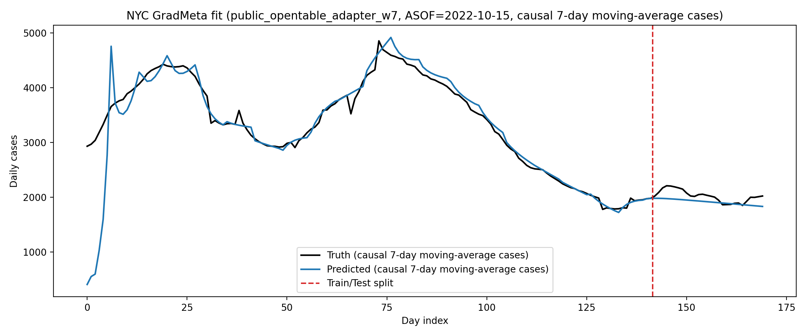

# NYC_GradMeta

NYC_GradMeta is an NYC-specific port of a GradMeta / DPEpiNN-style epidemic forecasting pipeline. The repository trains a two-encoder calibration network on public signals, optionally augments it with an OpenTable auxiliary signal, rolls the resulting weekly epidemiological parameters through a daily metapopulation SEIRM-Beta simulator, and optionally adds a GRU residual adapter on top of the mechanistic forecast. The current contract in code is a 28-day forecast horizon, weekly piecewise-constant parameters selected by `t // 7`, and a daily simulator step. The current repository also contains negative or unstable runs; those are informative and are called out explicitly below rather than hidden.

## 1) Quickstart

These commands use the processed CSVs already committed under `data/processed/`. They will write new artifacts into `outputs/nyc/2022-10-15/` and may overwrite local files with the same run tag.

### 5-minute smoke test: public-only

```bash
python3 -m venv .venv
. .venv/bin/activate
pip install -e .
chmod +x scripts/*.sh

.venv/bin/python scripts/prepare_online_nyc.py \
  --config configs/nyc.json \
  --asof 2022-10-15 \
  --window_days 170 \
  --smooth_cases_window 7

USE_ADAPTER=0 SMOOTH_CASES_WINDOW=7 WINDOW_DAYS=170 \
./scripts/run_from_processed.sh 2022-10-15 --no_private --epochs 1 --val_split 0
```

Expected outputs include:

- [outputs/nyc/2022-10-15/forecast_28d_w7.csv](outputs/nyc/2022-10-15/forecast_28d_w7.csv)
- `outputs/nyc/2022-10-15/metrics_public_only_w7.json` if you run the command above
- [outputs/nyc/2022-10-15/metrics_summary.csv](outputs/nyc/2022-10-15/metrics_summary.csv)

### 5-minute smoke test: public + OpenTable

```bash
.venv/bin/python scripts/build_private_opentable_tensor.py \
  --config configs/nyc.json \
  --asof 2022-10-15 \
  --opentable_csv data/processed/opentable_yoy_daily.csv \
  --opentable_col yoy_seated_diner

.venv/bin/python scripts/prepare_online_nyc.py \
  --config configs/nyc.json \
  --asof 2022-10-15 \
  --window_days 170 \
  --smooth_cases_window 7

USE_ADAPTER=0 SMOOTH_CASES_WINDOW=7 WINDOW_DAYS=170 \
./scripts/run_from_processed.sh 2022-10-15 --epochs 1 --val_split 0
```

Expected outputs include:

- [outputs/nyc/2022-10-15/forecast_28d_w7.csv](outputs/nyc/2022-10-15/forecast_28d_w7.csv)
- [outputs/nyc/2022-10-15/metrics_summary.csv](outputs/nyc/2022-10-15/metrics_summary.csv)

If you want the one-command smoothing smoke test already in the repo, use:

```bash
./scripts/smoke_test_smoothing.sh 2022-10-15
```

## 2) Data Sources + Licensing / Usage Notes

This repository ships processed data under `data/processed/`, including:

- `data/processed/nyc_master_daily.csv`
- `data/processed/cases_nyc_daily.csv`
- `data/processed/mobility_nyc_daily.csv`
- `data/processed/trends_us_ny_daily.csv`
- `data/processed/opentable_yoy_daily.csv`
- `data/processed/population_nyc_age16_2020.csv`
- `data/processed/contact_matrix_us.csv`
- windowed train/test files under `data/processed/online/`

Raw source files under `data/raw/` are not committed. To rebuild from raw inputs, you must supply the raw case, mobility, and OpenTable files locally and let the repo scripts regenerate the processed outputs.

Verified external sources referenced by code or existing repo documentation:

- NYC DOHMH / NYC Open Data daily COVID counts: <https://data.cityofnewyork.us/Health/COVID-19-Daily-Counts-of-Cases-Hospitalizations-an/rc75-m7u3/about_data>
- Google COVID-19 Community Mobility Reports historical source: <https://www.google.com/covid19/mobility/>
- Google Trends (repo uses topic id `/g/11j2cc_qll`, geo `US-NY-501`): <https://trends.google.com/trends/>
- Kaggle OpenTable reservation dataset page: <https://www.kaggle.com/datasets/pizacd/opentable-reservation-data>
- NYC Planning Population FactFinder: <https://popfactfinder.planning.nyc.gov/>
- Patchflow data repository: <https://github.com/nssac/patchflow-data>

Important usage notes:

- `build_cases_nyc.py` expects a raw citywide daily counts CSV at `data/raw/COVID-19_Daily_Counts_of_Cases,_Hospitalizations,_and_Deaths_20260213.csv`.
- `inspect_data.py` expects `data/raw/Region_Mobility_Report_CSVs.zip`.
- `build_opentable_yoy.py` expects `data/raw/YoY_Seated_Diner_Data.csv`.
- `download_trends_daily.py` can regenerate trends via `pytrends` if `data/processed/trends_us_ny_daily.csv` is absent.
- The committed NYC age-bin population file is built from NYS DOH Vital Statistics data in [`src/nyc_gradmeta/data/build_population_nyc_age16.py`](src/nyc_gradmeta/data/build_population_nyc_age16.py), not from Population FactFinder.
- [`src/nyc_gradmeta/data/process_patchflow_age_data.py`](src/nyc_gradmeta/data/process_patchflow_age_data.py) can normalize locally downloaded Patchflow-derived population/contact CSVs into the same 16-bin format used by this repo.
- External data remain subject to their original licenses and terms of use; this repo does not restate those licenses.

## 3) Repository Layout

- `configs/`
  - [`configs/nyc.json`](configs/nyc.json): active runtime config for the current pipeline.
  - [`configs/nyc.yaml`](configs/nyc.yaml): older high-level config sketch; not the main training config.
- `scripts/`
  - [`scripts/build_data.sh`](scripts/build_data.sh): rebuilds processed public data.
  - [`scripts/prepare_online_nyc.py`](scripts/prepare_online_nyc.py): constructs train/test CSVs for a specific ASOF date.
  - [`scripts/build_private_opentable_tensor.py`](scripts/build_private_opentable_tensor.py): converts OpenTable YoY into the aligned per-patch tensor.
  - [`scripts/run_nyc_master_only.sh`](scripts/run_nyc_master_only.sh): public-only runner.
  - [`scripts/run_nyc_with_opentable.sh`](scripts/run_nyc_with_opentable.sh): public + OpenTable runner.
  - [`scripts/run_from_processed.sh`](scripts/run_from_processed.sh): fastest way to train using already-built processed files.
  - [`scripts/smoke_test_smoothing.sh`](scripts/smoke_test_smoothing.sh): 1-epoch smoothing smoke test for `w=3` and `w=7`.
- `src/nyc_gradmeta/data/`
  - raw-to-processed builders for cases, mobility, trends, population, and OpenTable
  - [`src/nyc_gradmeta/data/seq_dataset.py`](src/nyc_gradmeta/data/seq_dataset.py): full-sequence dataset loader
  - [`src/nyc_gradmeta/data/process_patchflow_age_data.py`](src/nyc_gradmeta/data/process_patchflow_age_data.py): normalizes local Patchflow-derived age-stratified population/contact CSVs into the repo's 16-bin format
- `src/nyc_gradmeta/models/`
  - [`src/nyc_gradmeta/models/forecasting_gradmeta_nyc.py`](src/nyc_gradmeta/models/forecasting_gradmeta_nyc.py): main training / evaluation / artifact-writing entry point
- `src/nyc_gradmeta/sim/`
  - [`src/nyc_gradmeta/sim/model_utils.py`](src/nyc_gradmeta/sim/model_utils.py): ParameterNN, simulator, and residual adapter implementations
- `data/processed/`
  - committed processed tables used by the current repo
  - committed windowed `online/` train/test CSVs for `ASOF=2022-10-15`
- `outputs/nyc/<ASOF>/`
  - run outputs, forecasts, metrics, fit CSVs, and PNGs

Current output naming conventions in code:

- `forecast_28d_w<W>.csv` and `forecast_28d_w<W>_<run_tag>.csv`
- `fit_train_test_<run_tag>.csv`
- `fit_train_test_<run_tag>.png`
- `metrics_<run_tag>.json`
- `metrics_summary.csv`

There are also older legacy artifacts in `outputs/nyc/2022-10-15/` such as `forecast_34d*` and unsuffixed adapter outputs. Those predate the current smoothing/window contract and should not be treated as the canonical 28-day comparison files.

## 4) Pipeline Overview

The current code implements three modules.

### Module 1: ParameterNN / calibration network

Code entry points:

- [`src/nyc_gradmeta/sim/model_utils.py`](src/nyc_gradmeta/sim/model_utils.py)
- class `CalibNNTwoEncoderThreeOutputs`
- wrapper `param_model_forward(...)` in [`src/nyc_gradmeta/models/forecasting_gradmeta_nyc.py`](src/nyc_gradmeta/models/forecasting_gradmeta_nyc.py)

What it does:

- encodes `x_private` with a GRU + attention encoder
- encodes `x_public` with a second GRU + attention encoder
- concatenates the two embeddings
- decodes a weekly latent sequence
- outputs:
  - weekly epidemiological parameters `out` with shape `[W, 7]`
  - `seed_status` with shape `[P]`
  - `beta_matrix` with shape `[P, P]`

The weekly parameters are piecewise-constant by construction after decoding. In the simulator wrapper, the active week is chosen with:

```python
week_idx = min(t // 7, max_week_idx)
```

which matches the thesis design contract.

### Module 2: Metapopulation SEIRM-Beta simulator

Code entry points:

- [`src/nyc_gradmeta/sim/model_utils.py`](src/nyc_gradmeta/sim/model_utils.py)
- class `MetapopulationSEIRMBeta`
- function `forward_simulator(...)` in [`src/nyc_gradmeta/models/forecasting_gradmeta_nyc.py`](src/nyc_gradmeta/models/forecasting_gradmeta_nyc.py)

What it does:

- runs a daily compartment update
- uses the current weekly parameter vector selected by `t // 7`
- returns daily new infections (citywide forecast is the patch sum across the daily outputs)
- uses a 16-patch age-structured contact matrix and 16-bin age population vector

### Module 3: Error-correction adapter

Code entry point:

- class `ErrorCorrectionAdapter` in [`src/nyc_gradmeta/sim/model_utils.py`](src/nyc_gradmeta/sim/model_utils.py)

This is a lightweight GRU residual model. It takes the simulator’s daily citywide prediction sequence and learns an additive correction term. It is not a chunk-based adapter; it is a sequence model over the forecast itself.

### What is preserved vs. changed from the Bogotá-style reference

Verified from code comments and implementation:

- preserved:
  - two-encoder calibration architecture
  - weekly parameter decoding
  - staged training schedule (`gradmeta -> adapter -> together`)
  - sigmoid plus min/max scaling of epi, seed, and beta heads
- changed:
  - NYC data ingestion and feature schema
  - 16 age-bin patches
  - OpenTable YoY as the auxiliary signal
  - current forecast horizon fixed at 28 days

## 5) Data Contracts

### Public feature schema

The active config is:

- `target_source_column = total_cases`
- `public_feature_mode = all_public`
- `num_pub_features = 10`

For the committed `ASOF=2022-10-15`, the public feature map is:

- [`data/processed/online/public_feature_map_2022-10-15_history170_w7.csv`](data/processed/online/public_feature_map_2022-10-15_history170_w7.csv)

which maps:

- `pub_0 -> probable_cases`
- `pub_1 -> hospitalizations`
- `pub_2 -> deaths`
- `pub_3 -> mob_retail`
- `pub_4 -> mob_grocery`
- `pub_5 -> mob_parks`
- `pub_6 -> mob_transit`
- `pub_7 -> mob_work`
- `pub_8 -> mob_residential`
- `pub_9 -> trend_covid_topic`

### What `cases` means in the current code

This is important.

- Raw case inputs come from [`src/nyc_gradmeta/data/build_cases_nyc.py`](src/nyc_gradmeta/data/build_cases_nyc.py)
  - `cases = CASE_COUNT`
  - `probable_cases = PROBABLE_CASE_COUNT`
- [`src/nyc_gradmeta/data/build_master_daily.py`](src/nyc_gradmeta/data/build_master_daily.py) then defines:
  - `total_cases = cases + probable_cases`
- [`scripts/prepare_online_nyc.py`](scripts/prepare_online_nyc.py) uses:
  - `cases_raw = total_cases`
  - `cases = causal rolling mean of cases_raw` if `--smooth_cases_window > 0`, otherwise raw

So, in the current repo:

- `cases_raw` means `confirmed + probable`
- `cases` means either raw `confirmed + probable` or a causal moving average of that same series
- covariates are not smoothed by `prepare_online_nyc.py`

To change this behavior, edit `nyc.target_source_column` in [`configs/nyc.json`](configs/nyc.json).

### Train/test split logic

Verified from [`scripts/prepare_online_nyc.py`](scripts/prepare_online_nyc.py):

- default `window_days = 170`
- default `split_mode = horizon`
- default `test_days = nyc.test_days = 28`
- for `ASOF=2022-10-15` and `window_days=170`, the committed split file is:
  - [`data/processed/online/split_info_2022-10-15_history170_w7.json`](data/processed/online/split_info_2022-10-15_history170_w7.json)
- this yields:
  - `train_days = 142`
  - `test_days = 28`

The trainer can further carve a validation window out of the train sequence via `--val_split`. For the committed best `w7` adapter runs, the saved metrics show `train_len = 142`, which indicates `--val_split 0` was used for those specific runs.

### OpenTable processing contract

Verified from [`scripts/build_private_opentable_tensor.py`](scripts/build_private_opentable_tensor.py):

- source column is typically `yoy_seated_diner`
- the city-level daily series is aligned onto the master-date index up to `ASOF`
- missing dates are interpolated and filled
- the citywide signal is replicated across patches using population-share weights
- the saved tensor is `[P, T]` with `P = 16`
- the saved filename is `opentable_private_lap_<ASOF>.pt`

Important: despite the `_lap_` suffix, the current script does **not** apply Laplace noise. The name is legacy.

## 6) Running Experiments (Conditions A / B / C)

### Condition A: public-only baseline

Current public-only runner:

- [`scripts/run_nyc_master_only.sh`](scripts/run_nyc_master_only.sh)

Recommended thesis-aligned command using the current smoothing/window contract:

```bash
.venv/bin/python scripts/prepare_online_nyc.py \
  --config configs/nyc.json \
  --asof 2022-10-15 \
  --window_days 170 \
  --smooth_cases_window 7

USE_ADAPTER=1 SMOOTH_CASES_WINDOW=7 WINDOW_DAYS=170 \
./scripts/run_nyc_master_only.sh 2022-10-15 --val_split 0
```

Outputs go to `outputs/nyc/2022-10-15/` and include files such as:

- [outputs/nyc/2022-10-15/forecast_28d_w7_public_only_adapter_w7.csv](outputs/nyc/2022-10-15/forecast_28d_w7_public_only_adapter_w7.csv)
- [outputs/nyc/2022-10-15/fit_train_test_public_only_adapter_w7.csv](outputs/nyc/2022-10-15/fit_train_test_public_only_adapter_w7.csv)
- [outputs/nyc/2022-10-15/fit_train_test_public_only_adapter_w7.png](outputs/nyc/2022-10-15/fit_train_test_public_only_adapter_w7.png)
- [outputs/nyc/2022-10-15/metrics_public_only_adapter_w7.json](outputs/nyc/2022-10-15/metrics_public_only_adapter_w7.json)

### Condition B: public + OpenTable (non-private)

Current OpenTable runner:

- [`scripts/run_nyc_with_opentable.sh`](scripts/run_nyc_with_opentable.sh)

Recommended thesis-aligned command using the current smoothing/window contract:

```bash
.venv/bin/python scripts/build_private_opentable_tensor.py \
  --config configs/nyc.json \
  --asof 2022-10-15 \
  --opentable_csv data/processed/opentable_yoy_daily.csv \
  --opentable_col yoy_seated_diner

.venv/bin/python scripts/prepare_online_nyc.py \
  --config configs/nyc.json \
  --asof 2022-10-15 \
  --window_days 170 \
  --smooth_cases_window 7

USE_ADAPTER=1 SMOOTH_CASES_WINDOW=7 WINDOW_DAYS=170 \
./scripts/run_nyc_with_opentable.sh 2022-10-15 --val_split 0
```

Outputs include:

- [outputs/nyc/2022-10-15/forecast_28d_w7_public_opentable_adapter_w7.csv](outputs/nyc/2022-10-15/forecast_28d_w7_public_opentable_adapter_w7.csv)
- [outputs/nyc/2022-10-15/fit_train_test_public_opentable_adapter_w7.csv](outputs/nyc/2022-10-15/fit_train_test_public_opentable_adapter_w7.csv)
- [outputs/nyc/2022-10-15/fit_train_test_public_opentable_adapter_w7.png](outputs/nyc/2022-10-15/fit_train_test_public_opentable_adapter_w7.png)
- [outputs/nyc/2022-10-15/metrics_public_opentable_adapter_w7.json](outputs/nyc/2022-10-15/metrics_public_opentable_adapter_w7.json)

### Condition C: public + OpenTable with DP

Status: **planned, not implemented in the current repo**

What is missing today:

- no `epsilon` or privacy CLI flag in the training or preprocessing scripts
- no clipping or sensitivity computation in [`scripts/build_private_opentable_tensor.py`](scripts/build_private_opentable_tensor.py)
- no Laplace mechanism or other DP noise addition in the current code path
- no DP-specific artifact naming, metrics aggregation, or epsilon sweep logic
- no privacy accounting report

Files that would need modification for a Condition C implementation:

- [`scripts/build_private_opentable_tensor.py`](scripts/build_private_opentable_tensor.py)
- [`src/nyc_gradmeta/models/forecasting_gradmeta_nyc.py`](src/nyc_gradmeta/models/forecasting_gradmeta_nyc.py)
- optionally [`scripts/train_nyc.sh`](scripts/train_nyc.sh) and the runner scripts to propagate privacy flags

## 7) Results

These results are **preliminary** and come directly from committed artifacts in:

- [outputs/nyc/2022-10-15/metrics_summary.csv](outputs/nyc/2022-10-15/metrics_summary.csv)

To keep the comparison aligned with the current 28-day, `window_days=170`, smoothed-target contract, the most coherent pair of A/B runs currently committed are:

- Condition A: `public_only_adapter_w7`
- Condition B: `public_opentable_adapter_w7`

The repository also contains older legacy rows that do not match the current contract exactly:

- `public_opentable_adapter` reports `test_len = 34` in its JSON and aligns with older `forecast_34d*` artifacts
- `public_opentable_w7` is a 1-epoch smoke run, not a fully trained comparison

### Preliminary comparison table (adapter-enabled, `w=7`)

| Condition | Run tag | Test length | Test RMSE | Test MAE | Test MAPE |
| --- | --- | ---: | ---: | ---: | ---: |
| A: public-only | `public_only_adapter_w7` | 28 | 553.1390 | 547.3369 | 27.0473 |
| B: public + OpenTable | `public_opentable_adapter_w7` | 28 | 134.3718 | 113.5912 | 5.4687 |

Exact supporting files:

- A metrics: [outputs/nyc/2022-10-15/metrics_public_only_adapter_w7.json](outputs/nyc/2022-10-15/metrics_public_only_adapter_w7.json)
- B metrics: [outputs/nyc/2022-10-15/metrics_public_opentable_adapter_w7.json](outputs/nyc/2022-10-15/metrics_public_opentable_adapter_w7.json)
- A forecast CSV: [outputs/nyc/2022-10-15/forecast_28d_w7_public_only_adapter_w7.csv](outputs/nyc/2022-10-15/forecast_28d_w7_public_only_adapter_w7.csv)
- B forecast CSV: [outputs/nyc/2022-10-15/forecast_28d_w7_public_opentable_adapter_w7.csv](outputs/nyc/2022-10-15/forecast_28d_w7_public_opentable_adapter_w7.csv)
- A fit CSV: [outputs/nyc/2022-10-15/fit_train_test_public_only_adapter_w7.csv](outputs/nyc/2022-10-15/fit_train_test_public_only_adapter_w7.csv)
- B fit CSV: [outputs/nyc/2022-10-15/fit_train_test_public_opentable_adapter_w7.csv](outputs/nyc/2022-10-15/fit_train_test_public_opentable_adapter_w7.csv)
- A plot: [outputs/nyc/2022-10-15/fit_train_test_public_only_adapter_w7.png](outputs/nyc/2022-10-15/fit_train_test_public_only_adapter_w7.png)
- B plot: [outputs/nyc/2022-10-15/fit_train_test_public_opentable_adapter_w7.png](outputs/nyc/2022-10-15/fit_train_test_public_opentable_adapter_w7.png)

Condition A plot:



Condition B plot:



## 8) Smoothing Support (3-day / 7-day)

Smoothing is implemented in the current repo.

Verified behavior:

- flag: `--smooth_cases_window {0,3,7}`
- implemented in: [`scripts/prepare_online_nyc.py`](scripts/prepare_online_nyc.py)
- smoothing target: `cases_raw -> cases`
- method: `rolling(window=W, min_periods=1).mean()`
- causal only; not centered
- only the target series is smoothed
- mobility, trends, and OpenTable are **not** smoothed here

Saved train/test schema:

- `cases_raw`
- `cases`
- `pub_0 ... pub_9`

Saved forecast CSV schema:

- `day_idx`
- `pred_cases`
- `smooth_cases_window`
- `truth_cases`

Saved fit CSV schema:

- `day_idx`
- `split`
- `truth_cases`
- `pred_cases`
- `smooth_cases_window`

Why this matters:

- daily COVID reporting often has weekday / weekend cyclicality
- smoothing the target can stabilize training and improve visual interpretability
- the code now keeps the target definition consistent from train/test preparation through evaluation and plotting

Exact smoke-test command for smoothing is already in the repo:

```bash
./scripts/smoke_test_smoothing.sh 2022-10-15
```

## 9) Differential Privacy Plan (Condition C)

Condition C is not implemented yet.

Planned approach for the current repo structure:

- privacy unit:
  - `TBD`. The most defensible candidate in this aggregated setting is a user-level interpretation tied to the OpenTable contribution mechanism, but the current repo only sees an already aggregated city-level series.
- clipping strategy:
  - `TBD`. A practical implementation point would be [`scripts/build_private_opentable_tensor.py`](scripts/build_private_opentable_tensor.py) before saving `opentable_private_lap_<ASOF>.pt`.
- sensitivity `Δf`:
  - `TBD`. It is not computed anywhere in the current repo.
- mechanism:
  - Laplace mechanism applied to the OpenTable-derived series or tensor after clipping
- epsilon sweep:
  - planned values `{1, 5, 10, 100}`

Minimal implementation checklist:

1. Add privacy flags such as `--epsilon` and `--clip_bound`.
2. Define and document the privacy unit.
3. Clip the OpenTable signal before tensor replication.
4. Add Laplace noise with a documented sensitivity.
5. Save DP-specific artifacts and metrics in distinguishable filenames.

Conceptual reference for this plan in the thesis narrative: Dwork and Roth on differential privacy. Exact bibliography entry is `TBD` in this repo and should be taken from the final thesis bibliography.

## 10) Reproducibility Checklist

- known-good ASOF date in committed outputs: `2022-10-15`
- expected horizon:
  - `configs/nyc.json` sets `days_head = 28`
  - `configs/nyc.json` sets `nyc.test_days = 28`
  - `forward_simulator(...)` runs daily and the saved forecast uses the final `test_horizon` points
- verify 28-day contract:
  - inspect [`data/processed/online/split_info_2022-10-15_history170_w7.json`](data/processed/online/split_info_2022-10-15_history170_w7.json)
  - inspect [`outputs/nyc/2022-10-15/forecast_28d_w7_public_opentable_adapter_w7.csv`](outputs/nyc/2022-10-15/forecast_28d_w7_public_opentable_adapter_w7.csv)
- expected artifact families for a successful run:
  - `metrics_<run_tag>.json`
  - `forecast_28d_w<W>_<run_tag>.csv`
  - `fit_train_test_<run_tag>.csv`
  - `fit_train_test_<run_tag>.png`
  - `metrics_summary.csv`
- GPU vs CPU expectations:
  - the current training loop uses `batch_size=1`
  - `SeqDataset` returns one full sequence item
  - the simulator loop is sequential over daily timesteps
  - GPU helps with tensor ops, but speedup may be limited because the mechanistic simulator still advances day by day and the effective batch size is one long sequence

## 11) Citation Block

Use these as the repo-facing citation placeholders for the thesis. Where the repo does not contain enough information to verify a full citation, the entry is marked `TBD`.

- Guan, Z., Zhao, Z., Tian, F., Nguyen, D., Bhattacharjee, P., Tandon, R., Prakash, B. A., and Vullikanti, A. "A Framework for Multi-source Privacy Preserving Epidemic Analysis," arXiv:2506.22342, 2025. Available: <https://arxiv.org/abs/2506.22342>. Accessed: Mar. 4, 2026.
- Dwork & Roth differential privacy book: `TBD exact bibliography entry from the thesis reference manager`.
- Patchflow contact matrix repository: <https://github.com/nssac/patchflow-data>
- NYC DOHMH daily counts dataset: <https://data.cityofnewyork.us/Health/COVID-19-Daily-Counts-of-Cases-Hospitalizations-an/rc75-m7u3/about_data>
- Kaggle OpenTable reservation dataset: <https://www.kaggle.com/datasets/pizacd/opentable-reservation-data>
- Google Mobility historical source: <https://www.google.com/covid19/mobility/>
- Google Trends platform: <https://trends.google.com/trends/>
- NYC Planning Population FactFinder: <https://popfactfinder.planning.nyc.gov/>

## TODOs

- add the final Dwork & Roth citation used in the thesis bibliography
- implement Condition C (DP OpenTable path) if it becomes part of the thesis deliverable
